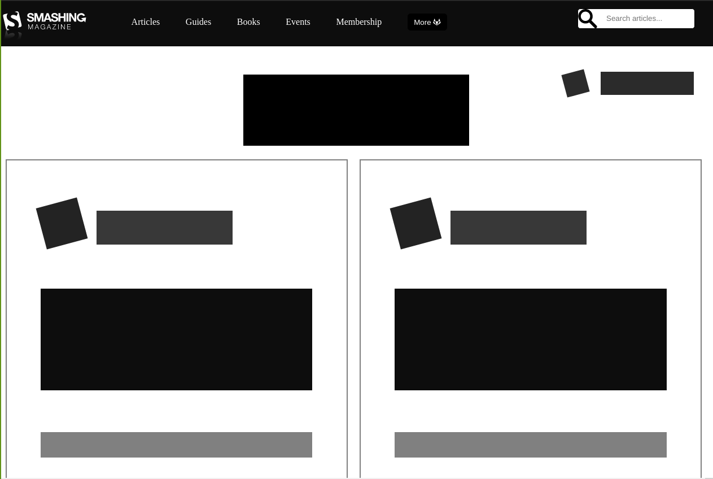

# Heat Map for smashing magazine

> The idea was to create a heatmap of the user interface of the smashing magazine landing page.

Project #5 created for the Microverse HTML-CSS Technical curriculum. Created a grayscale heatmap for the [smashing magazine](https://www.smashingmagazine.com/) landing page to layout the user interface design used in it.

## Built With

- HTML-CSS,
- Flexbox

## Live Demo

[Live Demo Link](https://raw.githack.com/jurgen1c/Design-Teardown/heatmap/index.html)

### Setup
It is setup to be viewed with the 1440 resolution as per project guidelines

## Authors

👤 **Mateo mojica**

- Github: [@mateomh](https://github.com/mateomh)
- Twitter: [@mateo_m_h](https://twitter.com/mateo_m_h)
- Linkedin: [linkedin](https://linkedin.com/mateo_mojica_hernandez)

👤 **Jurgen Clausen**

- Github: [@jurgen1c](https://github.com/jurgen1c)
- LinkenIn:[LinkenIn](https://www.linkedin.com/in/jurgen-clausen-2740061a9/)

## 🤝 Contributing

Contributions, issues and feature requests are welcome!

Feel free to check the [issues page](issues/).

## Show your support

Give a ⭐️ if you like this project!

## Acknowledgments

- Smashing Magazine
- Microverse
- Odin Project

## 📝 License

This project is [MIT](lic.url) licensed.

